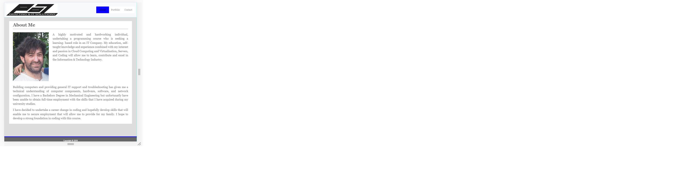
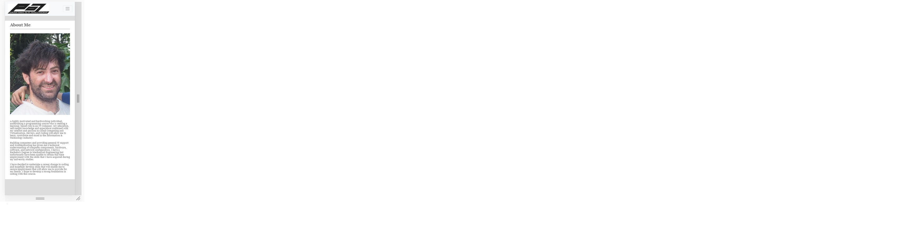
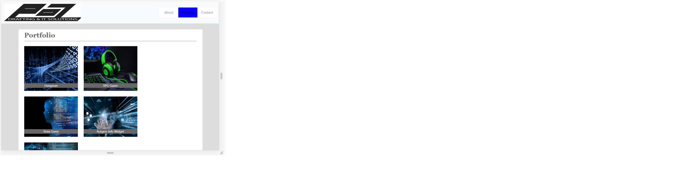
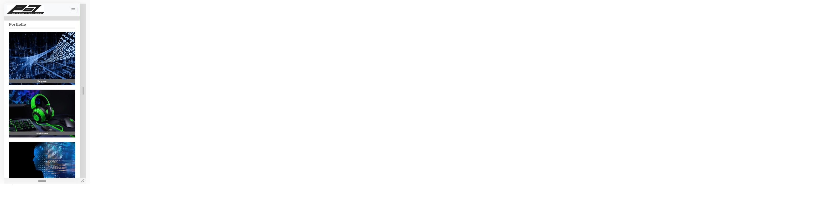
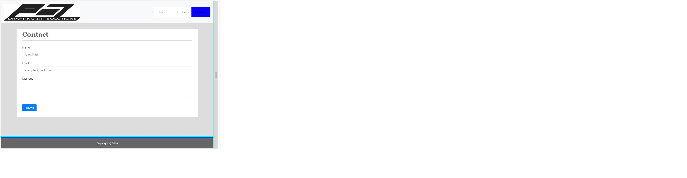
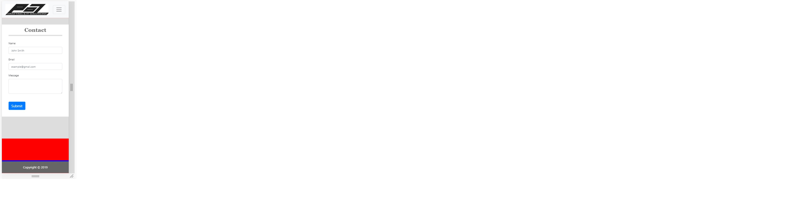

# updatedPortfolio

Summary

The web application is a website that presents the skills and capabilities of the web
developer for public viewing. The website consists of three linked web pages that will
enable the public to view the projects the developer has completed and a means to contact
the developer if interested in their skills.

The purpose of this application is to demonstrate responsive behaviour of html files
using media queries. This enables the developer to create web pages that can be viewed on
multiple devices and scrren sizes such as:
- iphone
- Tablet
- Laptop
- Desktop

The web application was also used to demonstrate how html and css code from bootstrap can
be implemented in order save time in constructing the html file from scratch. Some components
from bootstrap that were used in the development of this application were:
- Navigation Bar
- Sticky Footer
- Grid Layout
- Forms
- Buttons

Getting Started

This documentation will assist you in viewing this project. To view the project either open
the url of the deployed application with the following address in any browser:

https://pozengineer.github.io/Week02-Assignment/

Download and clone the repository from GitHub using the following command:

git clone https://github.com/pozengineer/Week02-Assignment.git

This application was built using:
- HTML: HyperText Markup Language that allows the developer to describe pages
- CSS: Style Sheet Language that allows the developer to style an HTML document
- BootStrap: Library of HTML and CSS files and code https://getbootstrap.com/

